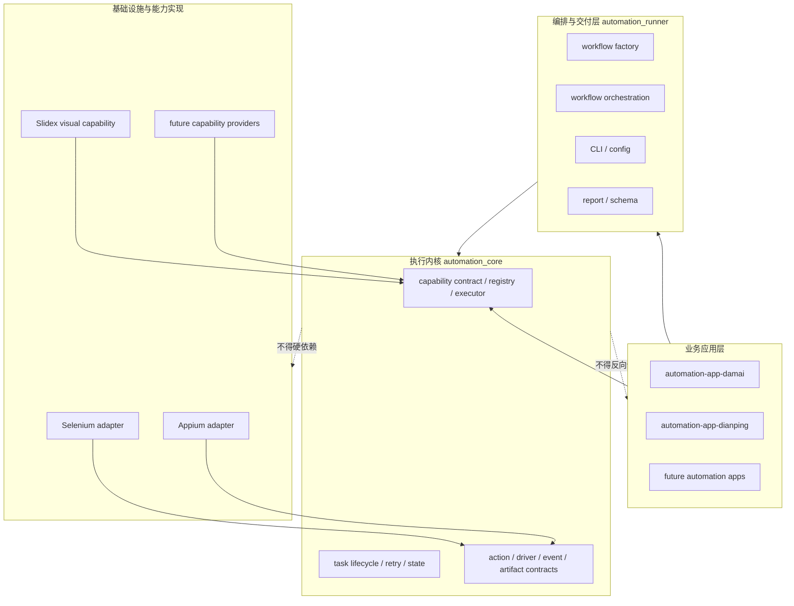
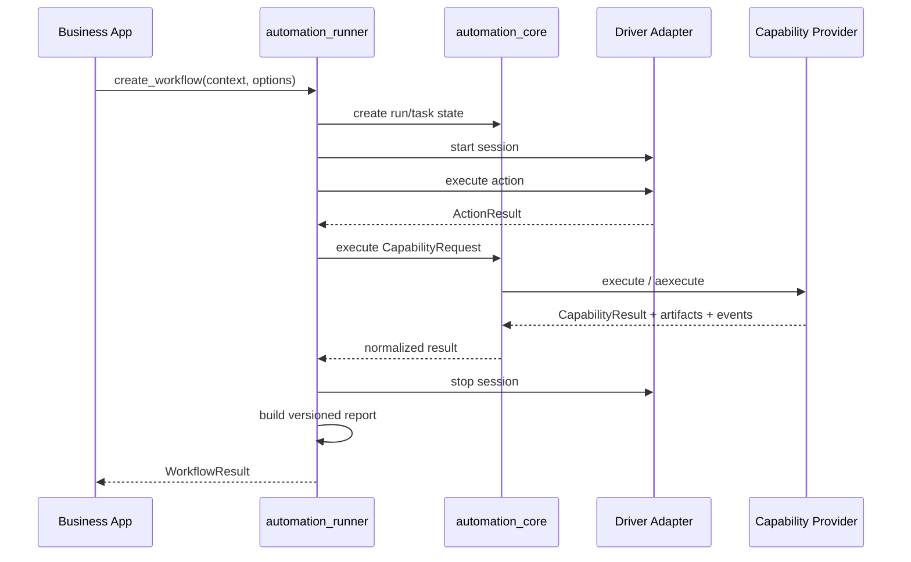

# automation-kit 平台开发总纲

最后更新：2026-07-18

本文是 automation-kit 生态唯一维护的开发、架构、状态与协作基线。README
只承担安装和使用入口，稳定的用户参考可以独立保留；架构决策、跨仓状态、开发计划、
验收标准和 agent 协作规则只在本文更新。历史过程通过 git 追溯，不再维护开发日志、
隐藏记忆文件或重复的阶段计划。

## 1. 平台定位

automation-kit 不是点评或大麦的专用脚本集合，而是为点评、大麦以及未来其他 Web、
Android 和图像自动化应用提供底层能力的通用平台。

平台交付三类稳定价值：

1. **执行内核**：统一任务生命周期、动作、重试、状态、事件、证据和错误语义。
2. **能力平台**：通过稳定契约注册、发现和调用浏览器、移动端、视觉等可插拔能力。
3. **应用框架**：让业务仓库只负责目标软件的流程、配置、选择器和业务验收。

点评和大麦是平台消费者及验收样板，不是底层抽象的定义者。任何只对单一目标软件有
意义的名称、规则或依赖都不得进入 `automation_core`。

### 1.1 目标

- 新应用可以只依赖公共契约构建工作流，不复制底层生命周期与错误处理。
- Selenium、Appium、Slidex 和未来 provider 可以替换或扩展，而不修改业务流程骨架。
- 同步动作和异步能力拥有明确边界，调用方不自行管理事件循环兼容逻辑。
- 每次运行都可以用 `run_id` / `task_id` 关联结果、事件、日志和 artifact。
- 默认测试完全离线；真实浏览器、设备、网络和账号测试显式选择执行。
- 公共契约可版本化，跨仓兼容可自动验证。

### 1.2 非目标

- 不把业务选择器、账号策略、反爬规则或站点名称放入核心。
- 不把 Playwright、Selenium、Appium、ADB、OCR 引擎或 Slidex 变成核心硬依赖。
- 不在当前阶段建设分布式调度中心、Web 管理后台或远程插件市场。
- 不承诺绕过目标平台安全规则；生产使用必须满足授权、合规和目标平台条款。
- 不恢复 `automation-plugin-ocr`；视觉能力统一由 Slidex 承担。

## 2. 仓库与所有权

| 仓库 | 平台角色 | 拥有内容 | 禁止内容 | 当前版本/状态 |
| --- | --- | --- | --- | --- |
| `automation-kit` | 执行内核与公共 SDK | 核心模型、能力契约、runner、通用 adapter、报告 | 业务规则、Slidex 或厂商硬依赖 | `0.2.0` |
| `slidex` | 可选视觉能力 provider | slider、OCR、图像识别、人工兜底、视觉 telemetry | 点评/大麦流程、反向要求核心依赖 Slidex | `0.4.0` |
| `automation-app-damai` | Web/业务应用 | 大麦配置、流程、业务验收、能力请求组装 | 通用执行内核、视觉算法 | `0.2.0` |
| `automation-app-dianping` | Android/业务应用 | 点评配置、流程、业务验收、能力请求组装 | 通用执行内核、OCR 实现 | `0.2.0` |
| `automation-plugin-ocr` | 归档仓库 | 仅保留迁移说明 | 任何新功能 | 已归档 |

`automation-plugin-ocr` 的 GitHub remote 当前返回 `Repository not found`。除非管理者明确
恢复远端，否则它不参与开发、发布或兼容矩阵。

## 3. 总体架构

采用“内核优先的模块化平台”架构。当前规模下所有契约先以 Python 包内接口交付，
保留未来进程外 provider 的可能性，但不提前引入网络协议和部署复杂度。



### 3.1 依赖规则

依赖只能向内：

```text
business apps -> automation_runner -> automation_core
business apps -> optional capability providers -> automation_core contracts
adapters -> automation_core contracts
```

- `automation_core` 只依赖 Python 标准库。
- `automation_runner` 可以依赖 `automation_core`，不能导入业务应用或 Slidex。
- adapter 实现核心的 `DriverSession` 等协议，核心不能导入具体 adapter。
- provider 实现核心能力协议；provider 可以提供到核心模型的单向映射。
- app 可以选择 provider，但必须在 provider 未安装时仍可导入并运行离线测试。
- 跨仓调用只依赖公共导出，不导入其他仓库的内部模块或测试 fixture。

### 3.2 分层职责

#### L0：公共模型

包含不可感知业务和技术实现的值对象：`ActionResult`、`ArtifactHandle`、
`EventEnvelope`、`RunState`、`CapabilityManifest`、`CapabilityRequest` 和
`CapabilityResult`。这些对象必须可测试、尽量可序列化，并保持向后兼容。

#### L1：执行内核

负责状态机、重试、任务执行、能力注册与调用、错误归一化和敏感信息处理。该层不启动
浏览器、不连接设备、不访问网络。

#### L2：编排层

负责 workflow factory、步骤编排、配置优先级、CLI、dry-run、报告生成和 schema。
编排层决定“何时调用什么”，不实现“能力如何完成”。

#### L3：adapter/provider 层

- adapter 把 Selenium、Appium 等外部 driver 映射为通用 session/action。
- provider 把视觉识别等高阶能力映射为统一 capability。
- 实现负责自己的资源申请与清理，调用方拥有的资源不得被 provider 关闭。

#### L4：业务应用层

拥有 workflow、目标 URL/package、选择器、业务数据校验、业务错误解释和 live E2E。
业务应用通过能力名和操作名请求能力，不依赖 provider 内部类。

## 4. 核心对象模型

### 4.1 运行身份

- `run_id`：一次完整 workflow 运行的唯一标识。
- `task_id`：一次任务或能力调用的唯一标识。
- `workflow_name`：稳定的工作流名称，用于发现、配置和报告。
- `correlation_id`：跨系统链路标识；未提供时可以等于 `run_id`。

所有事件、artifact 和 capability result 最终都必须可关联到上述身份。现有 runner 已有
部分 `run_id` / `task_id` 语义，后续阶段统一为显式 `ExecutionContext`。

### 4.2 动作与能力

动作与能力不是同一个抽象：

- **Action** 是 driver session 上的低阶、短时操作，例如 `click`、`tap`、`open`。
- **Capability** 是可发现、可替换、可能异步的高阶能力，例如视觉挑战求解、OCR、
  文档解析或人工确认。
- **Workflow** 组合 action 和 capability，表达业务过程。

不得为了复用而把所有业务步骤伪装成通用 action，也不得让 capability 接管整个业务
workflow。

### 4.3 能力协议

第一版公共能力协议使用以下语义：

```python
CapabilityManifest(
    name="visual.challenge",
    version="1.0.0",
    operations=("solve",),
    platforms=("web", "android", "image"),
)

CapabilityRequest(
    capability="visual.challenge",
    operation="solve",
    parameters={
        "challenge_type": "slider_captcha",
        "context": "playwright_page",
        "page": page,
    },
    metadata={"run_id": run_id, "task_id": task_id},
)

CapabilityResult(
    success=True,
    provider="slidex",
    data={...},
    artifacts=[...],
    events=[...],
)
```

约束：

- 能力名采用小写点分命名，如 `visual.challenge`、`document.extract`。
- 操作名采用小写 snake_case，必须由 manifest 明确声明。
- `parameters` 可以承载进程内资源句柄，但写入报告前必须经过安全序列化。
- `metadata` 只承载链路与策略信息，不放置密码、cookie 或 token 原文。
- provider 异常由 executor 归一化为 `CapabilityResult` 失败结果；注册、查找和协议错误
  使用明确异常，避免把平台配置错误误判为业务失败。
- 同步 provider 实现 `execute(request)`；异步 provider 实现 `aexecute(request)`。
- 同步入口不得隐式创建或嵌套事件循环；同步和异步 provider 必须分别通过对应入口
  调用。异步入口拒绝同步 provider，避免无法可靠取消的后台线程继续产生副作用。

### 4.4 能力注册与选择

`CapabilityRegistry` 是进程内注册表：

- 以 manifest 的 `name` 唯一注册 provider。
- 默认拒绝同名覆盖；显式 `replace=True` 才能替换，便于测试和受控装配。
- 支持按能力名读取、列出 manifest、按 operation/platform 过滤。
- 注册时校验 manifest 和 provider 执行入口。
- registry 不做全局单例，应用在 composition root 创建并注入，保证测试隔离。

第一版每个能力名只选择一个 provider。多 provider 优先级、健康检查、熔断和远程发现
在兼容协议稳定后增加，避免过早构建调度系统。

### 4.5 能力执行

`CapabilityExecutor` 承担统一调用边界：

1. 校验请求能力名与 operation。
2. 从 registry 解析 provider。
3. 选择同步或异步入口。
4. 捕获 provider 运行异常并生成稳定失败结果。
5. 校验返回值是 `CapabilityResult`。
6. 保留 artifact/event，供 workflow 报告层统一收集。

同步入口调用异步 provider、异步入口调用同步 provider 时均立即报调用模式错误，不
隐式创建事件循环或后台线程。provider 抛出的原始异常文本不得进入结果；失败结果只
保留错误类型和固定安全摘要，详细诊断只能进入经过脱敏与访问控制的日志系统。

平台错误分类：

| 分类 | 示例 | 处理 |
| --- | --- | --- |
| 注册错误 | manifest 非法、同名 provider | 启动/装配阶段立即失败 |
| 解析错误 | capability 不存在、operation 不支持 | 调用前立即失败 |
| 调用模式错误 | 同步/异步入口与 provider 模式不一致 | 改用与 provider 一致的入口 |
| provider 运行错误 | OCR 引擎异常、浏览器失败 | 返回失败 result，保留错误码 |
| 业务失败 | 未识别文本、验证未通过 | provider 定义 `retryable` 和业务错误码 |

## 5. 标准执行链路



资源所有权：

- 创建 browser/device/session 的组件负责关闭它。
- app 传给 provider 的 Playwright page 仍归 app 所有；provider 只清理自己创建的 listener、
  CDP session 和临时文件。
- executor 不关闭 provider，也不拥有 provider 内部连接池。
- 所有 `finally` 清理都必须有失败测试或资源所有权测试。

## 6. Slidex 视觉能力

Slidex 是 `visual.challenge` 的推荐 provider，不是 automation-kit 内核的一部分。

它负责：

- `slider_captcha`、`ocr_text`、`image_text` 等视觉挑战。
- Playwright page、CDP、图像 bytes/path、Android screenshot 等上下文。
- provider manifest、视觉结果、telemetry、视觉 artifact 和人工兜底。
- 将 `VisualChallengeResult` 单向转换为 `CapabilityResult`。

它不负责：

- 大麦或点评 workflow。
- Appium session 生命周期。
- automation-kit runner 的状态机和报告 schema。
- 关闭调用方传入的浏览器或 page。

Slidex 的 `SlidexVisualCapability` 适配器位于
`slidex.integrations.automation_kit`。未安装 automation-kit 时，Slidex 自身仍可导入和
运行；使用该适配器时通过 `slidex[automation-kit]` 或等价开发环境提供公共类型。
适配器在进入 solver 前校验 capability、operation、枚举、上下文必需输入和
`timeout_ms`。超时会取消异步 solver、返回 `error_code="timeout"`，并且只发出
`capability.end`；workflow 的 `task.end` 仍由 runner 独占生成。

## 7. 业务应用规范

每个 app 仓库至少包含：

```text
automation_app_<name>/
  __init__.py
  config.py       # 业务配置与校验
  workflow.py     # workflow factory 与能力请求组装
tests/
  test_config.py
  test_workflow.py
  test_imports.py
```

应用必须：

- 通过 `automation_runner.workflows` 构建 workflow。
- 通过 `automation_core.capabilities` 构建通用能力请求。
- 在 composition root 注入 registry/executor/provider，不在模块导入时初始化外部资源。
- 保留 provider 未安装时的默认离线测试。
- 对真实目标软件维护 opt-in live E2E，默认 CI 不执行。
- 把业务验收写成明确结果，不以“调用未抛异常”代替成功。

应用不得：

- 直接导入 Slidex 的内部模块。
- 复制核心重试、事件、artifact 或注册逻辑。
- 把 Appium/Selenium 原生对象写入 JSON 报告。
- 在仓库 README 维护另一套架构或开发状态。

## 8. 配置、报告与可观测性

### 8.1 配置优先级

稳定优先级为：显式 CLI > 环境变量 > 配置源 > 代码默认值。配置在加载 provider 或
session factory 前完成类型和空字符串校验。业务参数由 app 校验，平台参数由 runner
校验。

### 8.2 报告

报告 schema 必须带版本。新增可选字段保持向后兼容；删除或改变字段语义必须提升主
版本。报告只写安全序列化后的数据，不直接序列化 page、driver、bytes 或任意对象。

目标报告至少包含：

- schema version、run/workflow identity 和最终状态。
- action 与 capability 结果摘要。
- event 列表和 artifact 索引。
- 使用的 provider 名称与版本。
- 可公开的运行配置摘要。

### 8.3 脱敏

以下键名及其大小写变体必须递归脱敏：`authorization`、`cookie`、`password`、
`secret`、`token`、`x5sec`、`x5secdata`。原始图片和页面源也可能包含个人信息，
artifact 保留策略由部署方配置，默认不得上传公共 CI。

## 9. 版本与兼容

- automation-kit 公共契约采用语义化版本。
- app 的发布元数据声明 `automation-kit>=0.2.0,<0.3.0`；Poetry 仅在开发锁中使用
  sibling path 解析当前源码，wheel 不得包含本机路径。
- Slidex 的 automation-kit extra 声明兼容范围并运行跨仓契约测试。
- manifest 的 provider 版本描述 provider 行为版本，不替代 Python 包版本。
- 公共 dataclass 新增字段必须提供默认值；枚举新增值可以兼容，重命名/删除不兼容。
- `report-schema-v1.json` 冻结后只做兼容扩展；破坏性变化创建新 schema 文件。

## 10. 测试金字塔与发布门禁

### 10.1 测试层级

1. **核心单元测试**：状态、注册、解析、错误和序列化，不需要外部依赖。
2. **provider 契约测试**：同一组行为验证 fake 和真实 provider adapter。
3. **跨仓兼容测试**：app -> automation-kit -> Slidex 的请求/结果链路。
4. **adapter 集成测试**：使用 fake driver 验证 Selenium/Appium 映射和资源清理。
5. **live E2E**：真实页面/设备/网络，显式标记、按需执行、不得阻塞默认离线 CI。

### 10.2 默认验证命令

```bash
# automation-kit
PYTHONPATH=. pytest -q -o addopts=''

# automation-app-damai
PYTHONPATH=.:../automation-kit pytest -q -o addopts=''

# automation-app-dianping
PYTHONPATH=.:../automation-kit pytest -q -o addopts=''

# slidex
PYTHONPATH=. pytest -q

# slidex -> automation-kit contract
PYTHONPATH=.:../automation-kit pytest -q tests/test_automation_kit_integration.py
```

CI 拓扑：automation-kit 在 Python 3.8/3.11 执行完整测试；两个 app 在 Python
3.8/3.11 检出 sibling automation-kit 并执行 coverage 门槛，另有 app ->
automation-kit -> Slidex 的 3.11 契约 job；Slidex 在 Python 3.10/3.12 检出并安装
automation-kit 后执行完整测试。Python 3.8/3.11 测试环境统一用 pip 安装 sibling
源码；Poetry `2.4.1` 仅在 Python 3.11 契约 job 校验 lock，避免 Poetry/virtualenv
工具运行版本阻断 Python 3.8 测试。

### 10.3 2026-07-18 验证基线

| 范围 | 结果 |
| --- | --- |
| automation-kit 全量离线测试 | Python 3.8/3.12 均 `323 passed`，coverage `93.79%`/`93.82%` |
| Damai 默认/跨仓测试 | Python 3.8 `10 passed, 1 skipped`；Python 3.12 + Slidex `11 passed` |
| Dianping 默认/跨仓测试 | Python 3.8 `7 passed, 1 skipped`；Python 3.12 + Slidex `8 passed` |
| Slidex + automation-kit 全量测试 | Python 3.10/3.12 均 `258 passed` |
| 归档 OCR 基本测试 | `2 passed` |
| wheel 构建与隔离安装 | 四仓 wheel 构建通过；Python 3.8/3.12 隔离安装通过 |
| 五仓 `git diff --check` | 通过 |

## 11. 当前状态与差距

### 11.1 已实现

- automation-kit 已有 task/action/driver/event/artifact/retry/state 基础模型。
- automation-kit 已有通用 capability manifest/request/result、registry、同步/异步
  provider 协议与 executor。
- runner 已有 workflow、CLI、配置、dry-run、报告和 schema v1。
- Selenium/Appium adapter 已实现通用 `DriverSession`。
- Slidex 已有统一视觉 request/result、OCR、slider、provider manifest、人工兜底和
  automation-kit capability result/event/artifact 映射。
- Slidex 已通过 `SlidexVisualCapability` 实现通用视觉能力 provider。
- 大麦和点评只保留通用 capability 入口和跨仓纵向测试；旧 Slidex helper 已删除。
- OCR 独立插件已归档。

### 11.2 本轮已完成交付

本轮建立第一条平台能力纵向链路：

1. 在 `automation_core.capabilities` 增加 manifest、request、result、provider 协议、
   registry 和 executor。
2. 同步与异步 provider 均通过明确入口调用，并覆盖注册、解析、协议和运行错误测试。
3. 在 Slidex 增加 `SlidexVisualCapability`，把视觉请求与结果映射到通用能力协议。
4. 大麦和点评只保留依赖 automation-kit 的能力请求/执行入口，删除重复的旧 Slidex
   helper 和未使用的 `visual_solver` 注入参数。
5. 增加三仓纵向契约测试，证明 app 可以通过通用 executor 调用 fake/Slidex provider。
6. 经生产审查补强异常脱敏、严格请求校验、可取消超时、独立 capability 结束事件、
   双入口模式错误、版本约束和跨 Python 版本 CI。

### 11.3 后续阶段

#### 阶段 2：执行上下文与 workflow capability step

交付：统一 `ExecutionContext`；workflow 原生组合 action/capability；报告收集 capability
result。验收：同步和异步 workflow 各有端到端离线测试，`run_id`/`task_id` 在所有
event/artifact 中一致。

#### 阶段 3：发布与兼容矩阵

交付：发布 automation-kit 契约版本；CI 增加从正式包源安装的发布制品矩阵。app wheel
版本范围、源码 sibling 检出、四仓契约 CI 和本地 wheel 隔离安装已经建立。验收：正式
发布后不使用 sibling path 也能从包源完成安装与离线测试，兼容失败会阻止发布。

#### 阶段 4：provider 运行治理

交付：provider 优先级、健康状态、平台级超时、重试策略和可选熔断；策略仍由内核
控制。Slidex adapter 已有单次调用超时，但跨 provider 治理仍未实现。验收：多
provider 选择和故障转移完全由 deterministic 测试证明。

#### 阶段 5：真实应用闭环

交付：大麦 Playwright 和点评 Appium/ADB 的 opt-in E2E；真实结果关联报告、telemetry
和 artifact。验收：在授权测试环境中证明业务成功条件，并确认失败不会泄露凭据或
残留浏览器/设备会话。

## 12. 本轮已实现文件

### automation-kit

- 创建 `automation_core/capabilities/models.py`：公共能力值对象。
- 创建 `automation_core/capabilities/contracts.py`：同步/异步 provider 协议。
- 创建 `automation_core/capabilities/errors.py`：注册、解析、模式与协议错误分类。
- 创建 `automation_core/capabilities/registry.py`：注册、发现和校验。
- 创建 `automation_core/capabilities/executor.py`：同步/异步执行与错误归一化。
- 创建 `automation_core/capabilities/__init__.py`：稳定导出面。
- 创建 `tests/capabilities/test_models.py`、`test_registry.py`、`test_executor.py`。
- 修改 `tests/structure/test_boundaries.py`：守住核心依赖方向。

### slidex

- 修改 `slidex/integrations/automation_kit.py`：仅保留 `SlidexVisualCapability`，实现严格
  校验、超时、结果映射与 `capability.end`。
- 修改 `tests/test_automation_kit_integration.py`：覆盖通用能力请求、结果、超时取消、
  敏感字段和事件所有权。

### 应用仓库

- 修改两个 app 的 `workflow.py`：增加通用 `CapabilityRequest` 构造与异步 executor 调用。
- 修改两个 app 的 `tests/test_workflow.py`：证明新入口不直接依赖 Slidex 类型。

上述生产行为均先写失败测试，再实现最小代码；仓库默认测试和跨仓兼容测试均已执行。

## 13. Agent 协作与合并规则

总体分支管理者负责架构、边界、任务拆分、评审、跨仓兼容和文档；开发 agent 只在分配
范围内实现，不自行改变平台定位。

每个开发任务必须说明：

- 所属层和仓库，为什么代码应放在那里。
- 消费和产出的公共接口。
- 明确非目标与禁止依赖。
- 失败测试、通过测试和跨仓影响。
- 是否改变公共契约、schema 或版本范围。

合并门禁：

1. 不直接修改受保护的 `main` worktree。
2. 开发分支合并前 rebase 到最新 `origin/main`。
3. 跨仓契约发布按 automation-kit -> Slidex -> app 的顺序进行；下游 CI 只验证已经进入
   上游 `main` 的公共契约，不引用临时功能分支。
4. `git diff --check` 通过。
5. 仓库默认测试通过；涉及公共契约时跨仓兼容测试通过。
6. 公共接口、架构、状态或验收命令变化时同步更新本文。
7. 不重新引入开发日志、重复架构文档、隐藏项目状态或已完成计划目录。

## 14. 维护文档集合

仅维护以下文档职责：

- `automation-kit/docs/development.md`：本文，唯一开发与架构总纲。
- `automation-kit/docs/adding-a-workflow.md`：稳定的 workflow 使用指南。
- `automation-kit/docs/artifacts.md`：稳定的 artifact/report 用户契约。
- 各仓库 `README.md`：安装、最小用法和指向本文的入口。
- `slidex/docs/PROVIDER_GUIDE.md`：provider 作者使用指南。
- `slidex/CHANGELOG.md`：已发布版本历史。

原 `slidex/docs/ARCHITECTURE.md` 已删除；Slidex 内部实现细节通过模块代码、测试和
provider guide 维护，不再形成第二份总体架构。
