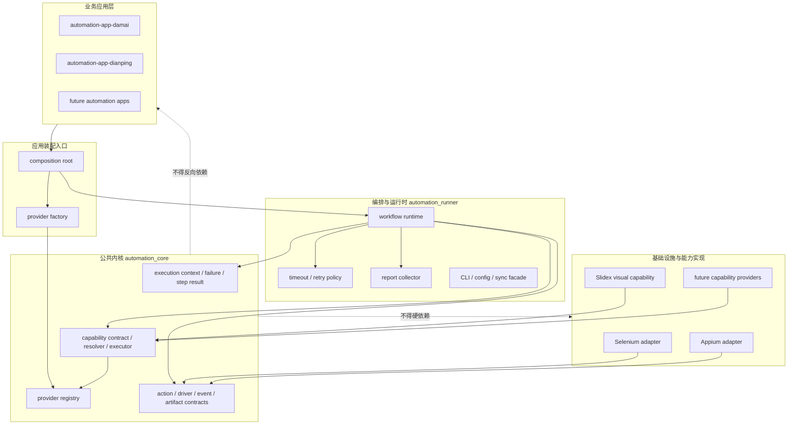
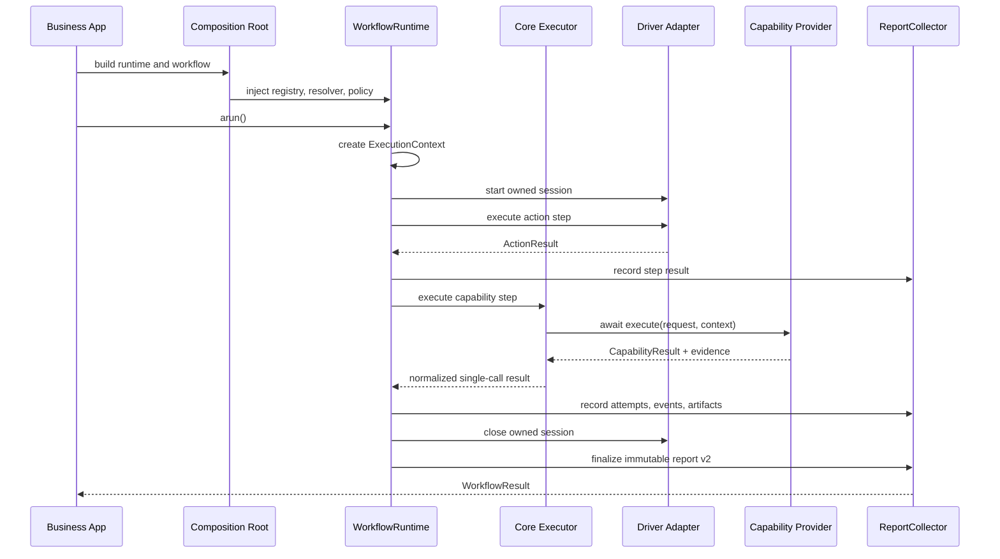

# automation-kit 平台开发总纲

最后更新：2026-07-19

本文是 automation-kit 生态唯一维护的开发、架构、状态与协作基线。README
只承担安装和使用入口，稳定的用户参考可以独立保留；架构决策、跨仓状态、开发计划、
验收标准和 agent 协作规则只在本文更新。历史过程通过 git 追溯，不再维护开发日志、
隐藏记忆文件或重复的阶段计划。

本文同时记录两个状态：**当前基线**描述已经交付并可运行的代码；**目标架构**描述已经
批准、但需要后续版本实现的边界。目标架构没有实现之前，不得在 README、公共 API 或
验收表中把它当成现状。

## 1. 平台定位

automation-kit 不是点评或大麦的专用脚本集合，而是为点评、大麦以及未来其他 Web、
Android 和图像自动化应用提供底层能力的通用平台。

平台交付三类稳定价值：

1. **执行内核**：统一任务生命周期、动作、重试、状态、事件、证据和错误语义。
2. **能力平台**：通过稳定契约注册、发现和调用浏览器、移动端、视觉等可插拔能力。
3. **应用框架**：让业务仓库只负责目标软件的流程、配置、选择器和业务验收。

点评和大麦是平台消费者及验收样板，不是底层抽象的定义者。任何只对单一目标软件有
意义的名称、规则或依赖都不得进入 `automation_core`。

### 1.1 目标

- 新应用可以只依赖公共契约构建工作流，不复制底层生命周期与错误处理。
- Selenium、Appium、Slidex 和未来 provider 可以替换或扩展，而不修改业务流程骨架。
- 当前 V1 的同步动作和异步能力拥有明确边界；目标 V2 由异步内核统一执行，调用方只
  使用 runtime 的异步入口或最外层同步外观，不自行管理事件循环兼容逻辑。
- 每次运行都可以用 `run_id` / `task_id` 关联结果、事件、日志和 artifact。
- 默认测试完全离线；真实浏览器、设备、网络和账号测试显式选择执行。
- 公共契约可版本化，跨仓兼容可自动验证。

### 1.2 非目标

- 不把业务选择器、账号策略、反爬规则或站点名称放入核心。
- 不把 Playwright、Selenium、Appium、ADB、OCR 引擎或 Slidex 变成核心硬依赖。
- 不在当前阶段建设分布式调度中心、Web 管理后台或远程插件市场。
- 不承诺绕过目标平台安全规则；生产使用必须满足授权、合规和目标平台条款。
- 不恢复 `automation-plugin-ocr`；视觉能力统一由 Slidex 承担。

### 1.3 架构状态

- 当前 `0.3.x`：提供 `ExecutionContext` / `ExecutionFailure` / step result 模型，以及
  Provider V2 的单一异步入口、`execution_profile`、registry/resolver/executor 分层。
- 目标完整 `0.3.x`：继续补齐异步内核、同步外观、一等 capability workflow step、统一
  `StepExecutionResult` 和 runtime-owned `ReportCollector`。
- 目标 `1.0.x`：冻结 workflow、capability、错误和 report v2 公共契约；在此之前目标
  设计允许破坏性调整，不添加没有外部需求支撑的兼容包装。

## 2. 仓库与所有权

| 仓库 | 平台角色 | 拥有内容 | 禁止内容 | 当前版本/状态 |
| --- | --- | --- | --- | --- |
| `automation-kit` | 执行内核与公共 SDK | 核心模型、能力契约、runner、通用 adapter、报告 | 业务规则、Slidex 或厂商硬依赖 | `0.3.0` |
| `slidex` | 可选视觉能力 provider | slider、OCR、图像识别、人工兜底、视觉 telemetry | 点评/大麦流程、反向要求核心依赖 Slidex | `0.5.0` |
| `automation-app-damai` | Web/业务应用 | 大麦配置、流程、业务验收、workflow step 声明 | 通用执行内核、视觉算法 | `0.3.0` |
| `automation-app-dianping` | Android/业务应用 | 点评配置、流程、业务验收、workflow step 声明 | 通用执行内核、OCR 实现 | `0.3.0` |
| `automation-plugin-ocr` | 归档仓库 | 仅保留迁移说明 | 任何新功能 | 已归档 |

`automation-plugin-ocr` 的 GitHub remote 当前返回 `Repository not found`。除非管理者明确
恢复远端，否则它不参与开发、发布或兼容矩阵。

## 3. 总体架构

采用“本机 Python SDK + 异步执行内核”的模块化平台架构。当前规模下所有契约都以
Python 包内接口交付；不建设 RPC、服务发现、分布式调度、多租户或远程 provider
协议，也不为这些假设中的需求预留空壳框架。



### 3.1 依赖规则

依赖只能向内：

```text
business apps -> composition root -> automation_runner -> automation_core
composition root -> optional capability providers -> automation_core contracts
adapters -> automation_core contracts
```

- `automation_core` 只依赖 Python 标准库。
- `automation_runner` 可以依赖 `automation_core`，不能导入业务应用或 Slidex。
- adapter 实现核心的 `DriverSession` 等协议，核心不能导入具体 adapter。
- provider 实现核心能力协议；provider 可以提供到核心模型的单向映射。
- app 只在 composition root 选择 provider；workflow 模块只声明能力需求。
- app 必须在可选 provider 未安装时仍可导入并运行默认离线测试。
- 跨仓调用只依赖公共导出，不导入其他仓库的内部模块或测试 fixture。

### 3.2 分层职责

#### L0：公共模型

包含不可感知业务和技术实现的值对象：`ExecutionContext`、`ExecutionFailure`、
`StepExecutionResult`、`ActionResult`、`ArtifactHandle`、`EventEnvelope`、`RunState`、
`CapabilityManifest`、`CapabilityRequest` 和 `CapabilityResult`。这些对象必须可测试、
安全序列化并遵循已声明的版本契约。

#### L1：执行内核

负责状态机、运行身份、能力注册/解析/单次调用、错误归一化和敏感信息处理。该层不
启动浏览器、不连接设备、不访问网络，也不持有业务资源。

#### L2：编排层

负责异步 workflow runtime、步骤编排、timeout/retry policy、资源作用域、CLI、dry-run、
报告收集和 schema。编排层决定“何时、以什么策略调用什么”，不实现“能力如何完成”。

#### L3：adapter/provider 层

- adapter 把 Selenium、Appium 等外部 driver 映射为通用 session/action。
- provider 把视觉识别等高阶能力映射为统一 capability。
- 实现负责自己的资源申请与清理，调用方拥有的资源不得被 provider 关闭。

#### L4：业务应用层

拥有 workflow、目标 URL/package、选择器、业务数据校验、业务错误解释和 live E2E。
业务应用通过能力名和操作名请求能力，不依赖 provider 内部类。

### 3.3 异步内核与同步外观

- `WorkflowRuntime.arun()` 是唯一原生执行入口，Action 和 Capability 都在同一个异步
  生命周期中执行。
- `WorkflowRuntime.run()` 只提供给没有运行中 event loop 的同步调用方；它不能在异步
  上下文中嵌套创建事件循环。
- 同步外观只存在于 runtime 最外层，核心 executor 和 Provider V2 不维护双入口。
- provider 和 action adapter 都不得在协程中隐藏未隔离的阻塞 I/O 或 CPU 工作。线程包装
  必须公开声明不可可靠取消；需要硬终止语义的阻塞任务使用独立 worker process 或
  driver 自身提供的终止接口。

### 3.4 Composition Root

每个 app 在唯一装配入口创建 `ProviderFactory`、`CapabilityRegistry`、
`CapabilityResolver`、policy 和 `WorkflowRuntime`。模块 import 不创建浏览器、线程、
连接或 provider 实例。Registry 在 workflow 启动前完成注册和校验，运行期间只读；测试
为每个用例创建独立装配，不使用全局单例或隐式共享状态。

## 4. 核心对象模型

### 4.1 运行身份

- `ExecutionContext` 是 runner 创建的不可变运行上下文，不使用 `metadata` 代替。
- `run_id`：一次完整 workflow 运行的唯一标识，由 runner 生成；调用方可以提供外部
  关联 ID，但不能伪造 step identity。
- `task_id`：一个 workflow step 的唯一标识，由 runner 为每个 step 生成。workflow 根上下文
  的 `task_id` 为 `None`，进入 step 前必须通过 `for_step(task_id)` 派生出非空 step 上下文。
- `workflow_name`：稳定的 workflow 名称，用于发现、配置和报告。
- `correlation_id`：跨系统链路标识；调用方可以提供，缺省时由 runner 生成。
- `deadline`：可选的绝对截止时间，作为 runtime policy 的输入，不由 provider 自行修改。
  step policy 的 timeout 不能突破该 deadline，二者取更早者；没有 deadline 时使用 step
  policy，二者都没有时使用 runtime 默认值。

推荐形状：

```python
ExecutionContext(
    run_id="run-1",
    task_id="step-3",
    workflow_name="damai-web",
    correlation_id="trace-1",
    deadline=None,
)
```

所有 event、artifact、action result 和 capability result 都必须由这个上下文关联。业务
扩展字段单独放在受控的 `metadata` 中；平台身份字段不能被 provider 覆盖。

### 4.2 动作与能力

动作与能力不是同一个抽象：

- **Action** 是 driver session 上的低阶、短时操作，例如 `click`、`tap`、`open`。
- **Capability** 是可发现、可替换、可能异步的高阶能力，例如视觉挑战求解、OCR、
  文档解析或人工确认。
- **WorkflowStep** 是 runtime 的生命周期单位，可以是 action 或 capability；它拥有
  step identity、执行策略、attempts、状态和结果。
- **Workflow** 组合 workflow step，表达业务过程。

不得为了复用而把所有业务步骤伪装成通用 action，也不得让 capability 接管整个业务
workflow。

### 4.3 步骤与结果

`WorkflowResult.steps` 是结果的唯一事实来源，不分别维护第二份 action/capability 状态。
Action 和 Capability 保持不同业务模型，但通过统一步骤包装进入 workflow 生命周期：

```python
StepExecutionResult(
    step_id="step-3",
    step_name="solve-captcha",
    kind="capability",
    status="succeeded",
    attempts=1,
    duration_ms=320,
    action_result=None,
    capability_result=CapabilityResult(...),
    error=None,
)
```

`WorkflowResult` 至少包含 `ExecutionContext`、最终状态、`steps`、事件和 artifact 索引。
旧的 `actions` 或 provider 专属字段只能作为从 `steps` 计算出的只读视图，不能成为第二
个写入路径。目标架构中的 capability 必须通过 `WorkflowStep.capability(...)` 进入
runtime，而不是由 app 在 workflow 外部手动调用 executor。

### 4.4 能力协议

当前 `0.2.x` 公共协议使用以下语义：

```python
CapabilityManifest(
    name="visual.challenge",
    version="1.0.0",
    operations=("solve",),
    platforms=("web", "android", "image"),
)

CapabilityRequest(
    capability="visual.challenge",
    operation="solve",
    parameters={
        "challenge_type": "slider_captcha",
        "context": "playwright_page",
        "page": page,
    },
    metadata={"run_id": run_id, "task_id": task_id},
)

CapabilityResult(
    success=True,
    provider="slidex",
    data={...},
    artifacts=[...],
    events=[...],
)
```

约束：

- 能力名采用小写点分命名，如 `visual.challenge`、`document.extract`。
- 操作名采用小写 snake_case，必须由 manifest 明确声明。
- `parameters` 可以承载进程内资源句柄，但写入报告前必须经过安全序列化。
- `metadata` 当前仍承载部分链路信息；新代码不得继续扩展这种用法，迁移目标是
  `ExecutionContext` 显式传递。
- provider 异常由 executor 归一化为 `CapabilityResult` 失败结果；注册、查找和协议错误
  使用明确异常，避免把平台配置错误误判为业务失败。
- Provider V2 只保留一个异步入口：

```python
class CapabilityProvider(Protocol):
    manifest: CapabilityManifest

    def execution_profile(
        self,
        request: CapabilityRequest,
    ) -> CapabilityExecutionProfile:
        ...

    async def execute(
        self,
        request: CapabilityRequest,
        context: ExecutionContext,
    ) -> CapabilityResult:
        ...
```

Manifest 必须声明执行特征，例如：

```python
CapabilityManifest(
    name="visual.challenge",
    version="1.0.0",
    operations=("solve",),
    platforms=("web", "android", "image"),
    default_cancellation="cooperative",
)
```

`execution_profile(request)` 是无副作用的同步描述，允许同一 capability 按 operation、
platform 或 context 声明不同取消能力。例如 Playwright slider 可以是 cooperative，线程
封装的同步 OCR 可以是 unsupported。Runtime 在执行前读取 profile，不能只依赖 manifest
顶层默认值。

原生异步 provider 必须响应取消。包含阻塞 OCR 或 CPU 工作的 provider 必须自己隔离；
线程包装只能声明不可可靠取消，runtime 不得对这类调用承诺硬超时。需要硬终止语义时，
provider 使用独立 worker process。V1 到 V2 的入口变化是公共契约变化，不能通过增加
第三个隐式入口解决。

### 4.5 能力注册与选择

`CapabilityRegistry` 是进程内注册表：

- 以 manifest 的 `name` 唯一注册 provider。
- 默认拒绝同名覆盖；显式 `replace=True` 才能替换，便于测试和受控装配。
- 支持按能力名读取、列出 manifest、按 operation/platform 过滤。
- 注册时校验 manifest 和 provider 执行入口。
- registry 不做全局单例，应用在 composition root 创建并注入，保证测试隔离。
- registry 在运行期间只读；provider 的替换只能发生在装配或显式测试 setup 阶段。

`CapabilityResolver` 独立于 registry，负责按 capability、operation、platform 和
manifest 选择 provider。当前只有一个 provider 时，resolver 只做确定性解析；多 provider
优先级、健康检查、熔断和 fallback 在真正出现第二个同类 provider 后增加。

### 4.6 能力执行与策略

`CapabilityExecutor` 只承担单次调用边界：

1. 校验请求能力名与 operation。
2. 从 resolver 得到 provider。
3. 在一个异步调用中执行 provider。
4. 响应取消并保证 executor 不越权关闭 provider 资源。
5. 捕获 provider 运行异常并生成稳定失败结果。
6. 校验返回值是 `CapabilityResult`。

执行策略由 `WorkflowRuntime` 的 capability step 持有，而不是由 provider 自行决定：

```python
CapabilityPolicy(
    timeout=30,
    max_attempts=2,
    backoff=1,
)
```

- provider 只返回业务结果和 `retryable` 建议，不自行 retry。
- runtime 是 timeout、retry、backoff、fallback 和最终失败判定的唯一权威。
- 每次 retry 保持同一个 `task_id`，增加 attempt 记录和 attempt event。
- timeout 只有一个来源；provider 不得再套一层无法协调的 platform timeout。

目标 V2 平台错误分类：

| 分类 | 示例 | 处理 |
| --- | --- | --- |
| 注册错误 | manifest 非法、同名 provider | 启动/装配阶段立即失败 |
| 解析错误 | capability 不存在、operation 不支持 | 调用前立即失败 |
| 请求/配置错误 | 参数结构非法、字段缺失 | 执行前抛出 typed exception |
| provider 运行错误 | OCR 引擎异常、浏览器失败 | 生成 `ExecutionFailure`，固定安全摘要 |
| timeout | 超过 runtime deadline | 进入 timeout failure，按 policy 决定 retry |
| cancelled | 调用方取消 workflow | 保留 `CANCELLED`，不转换为普通失败，不 retry |
| 业务失败 | 未识别文本、验证未通过 | 返回 `CapabilityResult(success=False)` |
| cleanup failure | listener、session 或临时资源清理失败 | 记录 secondary failure；不能覆盖原始错误 |

`ExecutionFailure` 至少包含 `category`、`code`、`message`、`retryable`、`source` 和已
脱敏的可序列化 `details`。原始异常文本和 traceback 只进入受控诊断日志，不进入公开
result 或 report。

### 4.7 资源所有权

- `WorkflowRuntime` 拥有本次 workflow 创建的 browser、device、driver、session 和临时
  根目录，并以 `AsyncExitStack` 管理其生命周期。
- provider 接收的 page、driver、session 是借用资源；provider 不得关闭调用方拥有的资源。
- provider 自己创建的 CDP session、listener、临时文件由 provider 在 `finally` 中清理。
- capability step 不通过全局变量持有跨 step 资源。
- workflow 取消时必须执行清理；清理失败不得把取消改写成成功。
- 所有资源清理规则必须由失败路径或资源所有权测试证明。

## 5. 标准执行链路



目标生命周期顺序：

1. Runtime 创建 `ExecutionContext` 和 workflow 资源作用域。
2. 每个 step 由 runtime 分配 `task_id`，按 policy 执行并写入 collector。
3. provider 只返回能力结果和能力证据；workflow 生命周期事件由 runtime 生成。
4. Runtime 在成功、失败或取消后统一关闭自己拥有的资源。
5. Collector 生成不可变 `WorkflowResult` 和 report v2。

当前 `0.2.x` 仍允许 app 在 workflow 外部直接调用 executor，作为纵向能力验证入口；该
入口不是目标 workflow 组合模型，迁移到 `WorkflowStep.capability(...)` 后应从业务模板中
删除。

## 6. Slidex 视觉能力

Slidex 是 `visual.challenge` 的推荐 provider，不是 automation-kit 内核的一部分。

它负责：

- `slider_captcha`、`ocr_text`、`image_text` 等视觉挑战。
- Playwright page、CDP、图像 bytes/path、Android screenshot 等上下文。
- provider manifest、视觉结果、telemetry、视觉 artifact 和人工兜底。
- 将 `VisualChallengeResult` 单向转换为 `CapabilityResult`。

它不负责：

- 大麦或点评 workflow。
- Appium session 生命周期。
- automation-kit runner 的状态机和报告 schema。
- 关闭调用方传入的浏览器或 page。

Slidex 的 `SlidexVisualCapability` 适配器位于
`slidex.integrations.automation_kit`。未安装 automation-kit 时，Slidex 自身仍可导入和
运行；使用该适配器时通过 `slidex[automation-kit]` 或等价开发环境提供公共类型。
适配器在进入 solver 前校验 capability、operation、枚举、上下文必需输入和
`timeout_ms`。当前 V1 超时会取消异步 solver、返回 `error_code="timeout"`，并由适配器
发出 `capability.end`；迁移到 V2 workflow step 后，事件由 runtime collector 统一生成，
workflow 的 `task.end` 仍由 runner 独占生成。

### 6.1 Provider 作者规范

Provider 是能力实现层，不是业务 workflow 层。Provider 作者必须：

- 声明稳定的 name、version、operations、platforms、支持的上下文和取消能力。
- 只实现能力本身；不得复制 workflow、retry、event、artifact store 或 registry 逻辑。
- 通过公共 `automation_core` 导出类型交互，不导入 app、测试 fixture 或核心内部实现。
- 对调用方传入的 page、driver、session 只做借用，不关闭、不改变所有权。
- 在自己创建的 listener、CDP handle、临时文件和 worker 上实现确定的 `finally` 清理。
- 将 provider 运行异常转换为安全错误；不得把 token、cookie、原始响应或 traceback 写入
  `CapabilityResult` 和公开 report。
- 为成功、业务失败、provider 异常、timeout、取消和清理失败提供 deterministic 测试。

Slidex 内部的 slider provider 可以继续使用 `CaptchaProvider`、检测、元素定位、图像
提取和轨迹执行等实现细节，但这些不是 automation-kit 公共契约。跨仓接入统一通过
`SlidexVisualCapability`，OCR、截图识别和人工兜底也不得重新复制 slider provider 抽象。
Provider 注册只发生在 composition root；不得依赖进程级全局注册表实现租户或请求隔离。

## 7. 业务应用规范

每个 app 仓库至少包含：

```text
automation_app_<name>/
  __init__.py
  config.py       # 业务配置与校验
  workflow.py     # workflow factory 与能力请求组装
tests/
  test_config.py
  test_workflow.py
  test_imports.py
```

当前 `0.2.x` 应用可以通过通用 helper 验证 capability 纵向链路，但不得把 helper 当成
最终 workflow 编排模型。目标 `0.3.x` 应用必须：

- 通过 `automation_runner.workflows` 构建 workflow。
- 在 workflow 中声明 `WorkflowStep.action(...)` 或 `WorkflowStep.capability(...)`，不在
  workflow 外部手动调用 executor 作为业务流程的一部分。
- 在 composition root 注入 registry、resolver、provider factory、policy 和 runtime，
  不在模块导入时初始化外部资源。
- 保留 provider 未安装时的默认离线测试。
- 对真实目标软件维护 opt-in live E2E，默认 CI 不执行。
- 把业务验收写成明确结果，不以“调用未抛异常”代替成功。

应用不得：

- 直接导入 Slidex 的内部模块。
- 复制核心重试、事件、artifact 或注册逻辑。
- 把 Appium/Selenium 原生对象写入 JSON 报告。
- 把 `run_id`、`task_id` 或 retry policy 塞入 capability metadata 代替显式上下文。
- 在仓库 README 维护另一套架构或开发状态。

### 7.1 Workflow 作者规范

仓库边界固定为：`automation_core` 提供模型和执行边界，`automation_runner` 提供
workflow authoring/runtime/CLI，`adapters` 提供 Selenium/Appium session，业务 app 或
`examples` 只负责目标软件流程。新 workflow 必须：

1. 放在业务 app 或 `examples/<domain>_<platform>/`，不能放入 `automation_core`。
2. 接受注入的 `session_factory`、provider registry 或 runtime，不在 import 时创建 live
   client。
3. 目标 V2 使用 `WorkflowStep.action(...)` 和 `WorkflowStep.capability(...)`；不把
   URL、selector、package name 或业务决策塞进公共核心。
4. 为 dry-run、默认离线 fake session 和 opt-in live E2E 分别提供测试。
5. 返回带有 context、steps、events 和 artifacts 的 `WorkflowResult`，不通过业务字典
   重新定义平台生命周期。

当前 V1 runner 仍支持 `create_workflow(session_factory)` 和
`create_workflow(session_factory, context, options)` 两种 factory 形状；V2 迁移完成后
统一使用 typed context/options。CLI 的优先级固定为：显式 CLI > 环境变量 > 配置源 >
代码默认值。`--param KEY=VALUE` 的值保持字符串，由业务 workflow 负责解析；空 key、
空 factory、空 URL、空 app id 在 factory 加载前拒绝。built-in workflow name 与
`--workflow-factory` 不能同时提供。

适配器 action alias 只能位于 adapter 层。Selenium/Appium 的 `open`、`click`、`tap`、
`type_text`、`launch_app`、`wait_for_element` 等别名必须返回公共 ActionResult；lookup
或执行失败不得静默抛弃。等待、批量 action 和 `stop_on_failure` 的执行结果必须明确区分
已执行与 skipped action。

## 8. 配置、报告与可观测性

### 8.1 配置优先级

稳定优先级为：显式 CLI > 环境变量 > 配置源 > 代码默认值。配置在加载 provider 或
session factory 前完成类型和空字符串校验。业务参数由 app 校验，平台参数由 runner
校验。

### 8.2 报告

报告 schema 必须带版本。当前 `report-schema-v1.json` 继续冻结；目标 `report-schema-v2`
以 `steps` 为中心。新增可选字段保持向后兼容；删除或改变字段语义必须提升主版本。
报告只写安全序列化后的数据，不直接序列化 page、driver、bytes 或任意对象。

目标 v2 报告至少包含：

- schema version、`ExecutionContext` 摘要和最终状态。
- `steps[]`，每个 step 包含 action 或 capability 结果、attempts、duration 和 failure。
- event 列表和 artifact 索引。
- 使用的 provider 名称与版本。
- 可公开的运行配置摘要。

#### 8.2.1 v1 冻结字段

`report-schema-v1.json` 仍描述当前 V1 runner 输出，字段必须与实际序列化结果保持一致。
下列字段是 v1 报告的完整顶层集合：

- `schema_version`
- `workflow`
- `workflow_factory`
- `session_factory`
- `workflow_context`
- `success`
- `status`
- `run_id`
- `run_state`
- `live`
- `elapsed_seconds`
- `events`
- `session`
- `actions`
- `artifacts`
- `error`
- `action_batch`

v1 的每个 artifact entry 只允许以下字段：

- `artifact_type`
- `path`
- `metadata`

v1 的 artifact metadata、event payload 和 workflow context 必须递归脱敏；不得把 raw bytes、
page/driver 对象、cookie、token、action data 或 skipped action parameters 写入公开报告。
新增或改变 v1 字段只能通过兼容扩展或新 schema 版本完成，不能静默修改语义。

### 8.3 事件与报告收集

`ReportCollector` 由 runtime 拥有，采用 append-only 记录并按 `event_id` 去重。provider
可以返回 capability-local evidence，但不能直接写 workflow 生命周期事件。目标事件顺序为：

```text
workflow.start
  -> step.start
  -> retry.attempt*
  -> action.end | capability.end
  -> artifact*
  -> step.end
  -> workflow.end
```

取消、主失败和清理失败必须保留在同一份 report 中；旁路日志、metrics、trace hook 不得
改变 workflow 结果。

Runtime 默认按声明顺序串行执行 step。并行 step 必须由 workflow 显式声明并拥有独立的
并发边界；collector 在事件循环内或受锁保护的临界区分配单调递增的 sequence，不能依赖
并行 provider 的完成顺序推断业务顺序。

### 8.4 脱敏

以下键名及其大小写变体必须递归脱敏：`authorization`、`cookie`、`password`、
`secret`、`token`、`x5sec`、`x5secdata`。原始图片和页面源也可能包含个人信息，
artifact 保留策略由部署方配置，默认不得上传公共 CI。

### 8.5 Artifact 契约

Artifact 是业务无关的调试证据，路径统一为：

```text
<artifact-root>/<run-id>/<artifact-type>/<artifact-name>
```

默认根目录为 `artifacts`；dry-run 可以返回 deterministic 路径但不写文件。`run_id`、
`artifact_type` 和 artifact name 都是单一安全路径组件：拒绝空值、`.`、`..` 和目录穿越，
空格按既定 store 规则规范化。推荐类型包括 `screenshot`、`page_source`、`ui_tree`、
`trace` 和 `log`。

JSON report 只允许写 artifact type、path 和脱敏 metadata；不得嵌入 raw bytes、page
source、图片、token、cookie、action data 或 skipped action parameters。adapter 负责捕获
具体证据，`ArtifactStore` 负责路径和记录，runner 负责 report attachment；三层不能互相
复制实现。

## 9. 版本与兼容

- automation-kit 公共契约采用语义化版本。
- app 的发布元数据声明 `automation-kit>=0.3.0,<0.4.0`；Poetry 仅在开发锁中使用
  sibling path 解析当前源码，wheel 不得包含本机路径。
- Slidex 的 automation-kit extra 声明兼容范围并运行跨仓契约测试。
- manifest 的 provider 版本描述 provider 行为版本，不替代 Python 包版本。
- 公共 dataclass 新增字段必须提供默认值；枚举新增值可以兼容，重命名/删除不兼容。
- `report-schema-v1.json` 冻结后只做兼容扩展；破坏性变化创建新 schema 文件。
- `0.3.x` 引入 Provider V2 和 workflow capability step；`0.2.x` 的双入口 provider
  协议只作为迁移基线，不再扩展。
- `1.0.x` 冻结 V2 workflow、capability、failure 和 report 契约。
- 跨仓发布顺序固定为 automation-kit -> Slidex -> app；下游依赖范围必须与已发布版本
  一致，不能依赖临时 sibling path 作为发布元数据。

## 10. 测试金字塔与发布门禁

### 10.1 测试层级

1. **核心单元测试**：状态、注册、解析、错误和序列化，不需要外部依赖。
2. **provider 契约测试**：同一组行为验证 fake 和真实 provider adapter。
3. **跨仓兼容测试**：app -> automation-kit -> Slidex 的请求/结果链路。
4. **adapter 集成测试**：使用 fake driver 验证 Selenium/Appium 映射和资源清理。
5. **live E2E**：真实页面/设备/网络，显式标记、按需执行、不得阻塞默认离线 CI。

目标架构必须增加以下回归门禁：

- `ExecutionContext` 身份在所有 step、event、artifact 和 report 中一致。
- `WorkflowStep.capability(...)` 的成功、业务失败、异常、timeout 和取消路径。
- provider 取消后无后台副作用；阻塞 provider 的取消能力声明与实际行为一致。
- retry 只由 runtime 执行，同一个 `task_id` 的 attempts 和 event 顺序稳定。
- provider 不关闭借用资源；runtime 在 workflow 结束、失败和取消时释放自有资源。
- `steps` 是唯一事实来源，report collector 不产生重复 event/artifact。
- wheel 的 `Requires-Dist` 不含本机路径，跨仓安装使用已发布版本范围。

### 10.2 默认验证命令

```bash
# automation-kit
PYTHONPATH=. pytest -q -o addopts=''

# automation-app-damai
PYTHONPATH=.:../automation-kit pytest -q -o addopts=''

# automation-app-dianping
PYTHONPATH=.:../automation-kit pytest -q -o addopts=''

# slidex
PYTHONPATH=. pytest -q

# slidex -> automation-kit contract
PYTHONPATH=.:../automation-kit pytest -q tests/test_automation_kit_integration.py
```

CI 拓扑：automation-kit 在 Python 3.8/3.11 执行完整测试；两个 app 在 Python
3.8/3.11 检出 sibling automation-kit 并执行 coverage 门槛，另有 app ->
automation-kit -> Slidex 的 3.11 契约 job；Slidex 在 Python 3.10/3.12 检出并安装
automation-kit 后执行完整测试。Python 3.8/3.11 测试环境统一用 pip 安装 sibling
源码；Poetry `2.4.1` 仅在 Python 3.11 契约 job 校验 lock，避免 Poetry/virtualenv
工具运行版本阻断 Python 3.8 测试。

### 10.3 2026-07-18 验证基线

| 范围 | 结果 |
| --- | --- |
| automation-kit 全量离线测试 | Python 3.8/3.12 均 `323 passed`，coverage `93.79%`/`93.82%` |
| Damai 默认/跨仓测试 | Python 3.8 `10 passed, 1 skipped`；Python 3.12 + Slidex `11 passed` |
| Dianping 默认/跨仓测试 | Python 3.8 `7 passed, 1 skipped`；Python 3.12 + Slidex `8 passed` |
| Slidex + automation-kit 全量测试 | Python 3.10/3.12 均 `258 passed` |
| 归档 OCR 基本测试 | `2 passed` |
| wheel 构建与隔离安装 | 四仓 wheel 构建通过；Python 3.8/3.12 隔离安装通过 |
| 五仓 `git diff --check` | 通过 |

## 11. 当前状态与差距

### 11.1 已实现

- automation-kit 已有 task/action/driver/event/artifact/retry/state 基础模型。
- automation-kit 已有通用 capability manifest/request/result、registry、同步/异步
  provider 协议与 executor。
- runner 已有 workflow、CLI、配置、dry-run、报告和 schema v1。
- Selenium/Appium adapter 已实现通用 `DriverSession`。
- Slidex 已有统一视觉 request/result、OCR、slider、provider manifest、人工兜底和
  automation-kit capability result/event/artifact 映射。
- Slidex 已通过 `SlidexVisualCapability` 实现通用视觉能力 provider。
- 大麦和点评只保留通用 capability 入口和跨仓纵向测试；旧 Slidex helper 已删除。
- OCR 独立插件已归档。

### 11.2 本轮已完成交付

本轮建立第一条平台能力纵向链路：

1. 在 `automation_core.capabilities` 增加 manifest、request、result、provider 协议、
   registry 和 executor。
2. 同步与异步 provider 均通过明确入口调用，并覆盖注册、解析、协议和运行错误测试。
3. 在 Slidex 增加 `SlidexVisualCapability`，把视觉请求与结果映射到通用能力协议。
4. 大麦和点评只保留依赖 automation-kit 的能力请求/执行入口，删除重复的旧 Slidex
   helper 和未使用的 `visual_solver` 注入参数。
5. 增加三仓纵向契约测试，证明 app 可以通过通用 executor 调用 fake/Slidex provider。
6. 经生产审查补强异常脱敏、严格请求校验、可取消超时、独立 capability 结束事件、
   V1 双入口模式边界、版本约束、发布制品和跨 Python 版本 CI；V2 runtime 设计列入阶段 2。

### 11.3 后续阶段

#### 阶段 2：执行上下文与 workflow capability step

交付：统一 `ExecutionContext`、`ExecutionFailure`、`StepExecutionResult`；实现异步
`WorkflowRuntime` 和同步外观；增加 `WorkflowStep.capability(...)`、单一异步 Provider V2
入口、runtime-owned policy 和 `ReportCollector`；输出 report schema v2。验收：同步和
异步 workflow 各有端到端离线测试，成功、业务失败、异常、timeout、取消和清理失败路径
均可验证，`run_id`/`task_id` 在所有 step/event/artifact 中一致。
对应详细任务：Task 1、Task 2、Task 3、Task 4、Task 5。

#### 阶段 3：发布与兼容矩阵

交付：发布 automation-kit 契约版本；CI 增加从正式包源安装的发布制品矩阵。app wheel
版本范围、源码 sibling 检出、四仓契约 CI 和本地 wheel 隔离安装已经建立。验收：正式
发布后不使用 sibling path 也能从包源完成安装与离线测试，兼容失败会阻止发布。
对应详细任务：Task 0、Task 6 的版本发布部分、Task 8 的发布门禁。

#### 阶段 4：provider 运行治理

交付：`CapabilityResolver`、provider 优先级、健康状态、平台级超时、重试策略和可选
熔断；策略仍由 runtime 控制。Slidex adapter 已有单次调用超时，但跨 provider 治理仍
未实现。验收：多 provider 选择、故障转移和取消能力完全由 deterministic 测试证明。
对应详细任务：Task 2 的 resolver 基线；优先级/健康检查/熔断仅在出现第二个同类
provider 后开启，不得在当前阶段预建空壳。

#### 阶段 5：真实应用闭环

交付：大麦 Playwright 和点评 Appium/ADB 的 opt-in E2E；真实结果关联报告、telemetry
和 artifact。验收：在授权测试环境中证明业务成功条件，并确认失败不会泄露凭据或
残留浏览器/设备会话。
对应详细任务：Task 7、Task 8 中 app 侧 live 配置和证据门禁。

## 12. 详细开发方案

本节是目标架构的可执行实施方案。开发 agent 必须按任务顺序推进；任务中的文件路径、
公共输入输出和测试门禁是交付边界，不得以“先实现再补抽象”的方式跨层放置代码。每个
任务独立提交，提交只包含该任务及其必要测试、类型导出、版本或文档变更。任务完成后，
先在所属仓库验证，再进入下一任务；跨仓任务必须按 automation-kit -> Slidex -> app
顺序发布。

阶段到任务的映射：

| 阶段 | 任务 | 说明 |
| --- | --- | --- |
| 阶段 2 | Task 1-5 | L0/L1/L2 执行内核、runtime、collector、资源边界 |
| 阶段 3 | Task 0、Task 6 发布、Task 8 发布门禁 | 版本、wheel、正式包源矩阵 |
| 阶段 4 | Task 2 resolver 基线 | 多 provider 治理仅在真实需求出现后扩展 |
| 阶段 5 | Task 7-8 | 业务 app 迁移与真实闭环证据 |

### 12.1 分层实施原则

| 层 | 所属模块 | 可以依赖 | 不得承担 |
| --- | --- | --- | --- |
| L0 模型 | `automation_core.execution`、现有 core models | Python 标准库和其他 L0 值对象 | provider 选择、I/O、重试和业务解释 |
| L1 内核 | `automation_core.capabilities`、driver contracts | L0、公共协议 | workflow 编排、资源创建、业务配置 |
| L2 编排 | `automation_runner` | L0/L1、注入的 adapter/provider | OCR、浏览器细节、站点选择器 |
| L3 实现 | `adapters`、Slidex provider | 公共 core contracts、外部 SDK | 修改 runtime 状态、关闭借用资源 |
| L4 应用 | Damai、Dianping、examples | runner 公共入口和已发布 provider | 复制 retry/event/artifact/registry |

每个任务均遵守三条硬约束：

1. 输入边界由上层传入，输出边界由本层公共类型返回；不把下层私有对象泄漏到上层。
2. 失败必须在本层转换为已声明的错误或结果；不能用 `None`、裸字典或日志替代状态。
3. 测试必须覆盖成功、失败和取消/清理路径中该层拥有的责任；没有测试门禁的目标能力
   不得标记为完成。

### 12.2 Task 0：冻结基线、版本与发布顺序

- **所属层和仓库**：项目管理层；`automation-kit` 的 `docs/development.md`、
  `pyproject.toml`、`.github/workflows/ci.yml`，并读取四个下游仓库的发布元数据。
- **输入/输出接口**：输入是当前 `0.2.x` 公共 API、已发布 wheel、四仓依赖范围和 CI
  基线；输出是本文第 2、9、10 节中的版本矩阵、任务分支命名和
  automation-kit -> Slidex -> app 的发布顺序。不得在代码里增加接口。
- **实现边界**：建立 `0.3.x` 破坏性迁移窗口；冻结 `report-schema-v1`；把 V1 双入口
  标记为迁移对象而不是继续扩展的兼容目标；确认四仓 CI 使用正式发布版本验证，开发
  时才允许 sibling path。
- **测试文件和场景**：
  `tests/structure/test_boundaries.py` 验证 core 不依赖 app/provider；
  `tests/runner/test_report_schema.py` 验证 v1 schema 不变；四仓 CI 各运行一次离线
  smoke 和 wheel metadata 检查，确认 `Requires-Dist` 不含本机路径。
- **执行命令**：
  `PYTHONPATH=. pytest -q -o addopts=''`；
  `python -m build`；
  `python -m pip wheel --no-deps . -w /tmp/automation-kit-wheels`；
  `git diff --check`。
- **独立提交边界**：`docs: freeze v2 migration baseline`；只允许版本/CI/总纲基线变更，
  不提交 runtime 实现。
- **依赖前置与验收条件**：前置是当前四仓工作树干净且基线测试通过；验收是版本范围、
  发布顺序、v1 冻结和默认离线命令均能由文档及 CI 复现，且没有未记录的开放决策。

### 12.3 Task 1：实现 L0 execution models

- **所属层和仓库**：L0，`automation-kit`。
- **精确文件路径**：新增 `automation_core/execution/__init__.py`、
  `automation_core/execution/context.py`、`automation_core/execution/failures.py`、
  `automation_core/execution/results.py`；修改 `automation_core/__init__.py` 的稳定导出；
  新增 `tests/execution/test_context.py`、`tests/execution/test_failures.py`、
  `tests/execution/test_results.py`。
- **输入/输出接口**：
  `ExecutionContext(run_id, task_id, workflow_name, correlation_id, deadline, metadata)`
  为 frozen 值对象；`for_step(task_id)` 返回同一 run identity、非空 step identity 的
  新 context；`ExecutionFailure(category, code, message, retryable, source, details)`
  只允许安全可序列化 details；`StepExecutionResult` 接收 action 或 capability 的一个
  结果并输出稳定 status、attempts、duration、failure；`WorkflowResult` 只以 `steps`
  为事实来源并提供不可写的派生视图。
- **实现边界**：模型不导入 provider、runner、driver SDK 或业务 app；身份字段不可被
  metadata 覆盖；根 context 的 `task_id` 必须是 `None`，step context 必须显式派生；
  序列化遇到 page、driver、bytes 等对象必须产生安全占位或拒绝，而不是隐式 `repr`。
- **测试文件和场景**：验证 frozen/不可变、根到 step 的身份继承、空/重复 task id 拒绝、
  deadline 序列化、敏感字段递归脱敏、八类 failure category、action/capability 互斥、
  `steps` 派生视图不产生第二写入路径，以及 Python 3.8 dataclass 行为。
- **执行命令**：`PYTHONPATH=. pytest -q tests/execution tests/structure/test_boundaries.py -o addopts=''`。
- **独立提交边界**：`feat: add execution identity and result models`；不修改 runtime、
  provider adapter 或 report v2。
- **依赖前置与验收条件**：前置是 Task 0；验收是 L0 可独立导入，核心测试不启动外部
  资源，所有公共类型从稳定包入口导出，且 `WorkflowResult.steps` 已成为唯一事实来源。

### 12.4 Task 2：迁移 L1 Provider V2、Resolver 与 Executor

- **所属层和仓库**：L1，`automation-kit`。
- **精确文件路径**：修改 `automation_core/capabilities/contracts.py`、`models.py`、
  `registry.py`、`executor.py`、`errors.py` 和 `__init__.py`；新增
  `automation_core/capabilities/resolver.py`；修改 `tests/capabilities/test_models.py`、
  `test_registry.py`、`test_executor.py`；新增 `tests/capabilities/test_resolver.py`、
  `test_provider_v2_contract.py`。
- **输入/输出接口**：`CapabilityProvider.execute(request, context)` 是唯一异步入口；
  `execution_profile(request) -> CapabilityExecutionProfile` 是无副作用描述；
  `CapabilityResolver.resolve(capability, operation, platform, request)` 选择 provider；
  `CapabilityExecutor` 接收 resolver 和 context，输出已校验的 `CapabilityResult` 或
  typed `ExecutionFailure`。
- **实现边界**：Registry 只登记和校验，Resolver 只选择，Executor 只做单次调用；
  timeout/retry/fallback 不得进入三者；运行期间 registry 只读；V1 `execute(request)` /
  `aexecute(request)` 双入口在迁移提交中直接删除，不增加第三个包装入口；manifest 的
  `default_cancellation` 不能替代 request-specific profile。
- **测试文件和场景**：覆盖非法 manifest、同名注册、operation/platform 解析、单 provider
  确定性选择、V2 返回类型错误、provider exception 脱敏、cooperative cancellation、
  unsupported cancellation 的显式声明、取消不 retry，以及借用资源不被 executor 关闭。
- **执行命令**：`PYTHONPATH=. pytest -q tests/capabilities tests/structure/test_boundaries.py -o addopts=''`；
  `python -m build`。
- **独立提交边界**：`feat: migrate capability execution to provider v2`；公共契约改变时
  同步提升 pre-1.0 minor 版本并更新兼容矩阵，不修改 Slidex/app。
- **依赖前置与验收条件**：前置是 Task 1 的 context/failure 类型；验收是 core 内不存在
  V1 provider 双入口调用路径，resolver/registry/executor 可分别替换测试，错误分类和
  取消能力均有确定性测试。

### 12.5 Task 3：拆分 L2 WorkflowStep 与 WorkflowRuntime

- **所属层和仓库**：L2，`automation-kit`。
- **精确文件路径**：从当前过大的 `automation_runner/workflows.py` 拆出新增
  `automation_runner/steps.py`、`automation_runner/policies.py`、
  `automation_runner/runtime.py`；修改 `automation_runner/workflows.py`、
  `automation_runner/runner.py`、`automation_runner/__init__.py`；新增
  `tests/runner/test_steps.py`、`test_runtime.py`、`test_runtime_cancellation.py`、
  `test_runtime_resources.py`。
- **输入/输出接口**：`WorkflowStep.action(...)` 和
  `WorkflowStep.capability(request_builder, policy)` 只保存声明；
  `WorkflowRuntime.arun(workflow, context=None) -> WorkflowResult` 是原生入口；
  `WorkflowRuntime.run(...)` 只为无运行 event loop 的同步调用方服务；
  `CapabilityPolicy(timeout, max_attempts, backoff, fallback)` 由 runtime 解释。
- **实现边界**：runtime 创建 root context、为每个 step 派生 task context、执行 action 或
  capability、按 policy 处理 timeout/retry/backoff/fallback，并以 `AsyncExitStack` 拥有
  workflow 资源；step 不直接访问 registry 内部；同步外观不得嵌套 event loop；默认串行，
  并行必须显式声明独立边界。`automation_runner.context.WorkflowContext` 继续作为 CLI 与
  factory 配置上下文；`automation_core.execution.ExecutionContext` 是 runtime 生命周期
  身份。两者不得混写：factory 可以读取 `WorkflowContext`，runtime 内部只能创建和传递
  `ExecutionContext`。
- **测试文件和场景**：验证 action/capability 顺序、成功和业务失败、provider exception、
  timeout、调用方取消、retry 次数和 backoff、deadline 取更早值、同步入口在已有 loop
  中拒绝、workflow 失败/取消后 session 仍清理，以及 fallback 只在 policy 允许时触发。
- **执行命令**：`PYTHONPATH=. pytest -q tests/runner tests/tasks tests/actions -o addopts=''`；
  `PYTHONPATH=. pytest -q tests/examples`。
- **独立提交边界**：`feat: add layered workflow runtime`；允许删除旧 workflow 内部
  helper，但不引入 report collector 逻辑，避免 Task 3/4 交叉写状态。
- **依赖前置与验收条件**：前置是 Task 1、Task 2；验收是 runtime 成为唯一 workflow
  生命周期拥有者，`WorkflowResult.steps` 中每个 step 都具有 context、status、attempts
  和 failure，且现有离线 action workflow 可迁移运行。

### 12.6 Task 4：实现 ReportCollector 与 report schema v2

- **所属层和仓库**：L2，`automation-kit`。
- **精确文件路径**：新增 `automation_runner/collector.py`、
  `automation_runner/schemas/report-schema-v2.json`；修改 `automation_runner/reports.py`、
  `automation_runner/schemas/__init__.py`、`automation_runner/cli.py`、
  `pyproject.toml`；新增 `tests/runner/test_collector.py`、`test_report_schema_v2.py`、
  `test_report_event_order.py`。
- **输入/输出接口**：`ReportCollector.record(event)`、`record_step(result)`、
  `attach_artifact(handle)`、`finalize(result) -> WorkflowResult/report`；事件必须带
  event id、run/task identity、sequence 和安全 payload；schema v2 以 `steps[]`、events、
  artifacts、provider summary 为主要输出。
- **实现边界**：collector 由 runtime 创建并独占 workflow 生命周期事件；append-only
  记录按 `event_id` 去重；并行声明下 sequence 在受保护临界区分配；provider-local evidence
  只能映射为 capability 结果，不能写 `workflow.start/step.end`；v1 文件和 CLI 输出冻结。
- **测试文件和场景**：验证成功/失败/取消/cleanup failure 均有 workflow.end，事件顺序
  稳定，重复 event/artifact 不重复，平行完成顺序不改变声明顺序，payload 脱敏，v2
  schema 与实际 report 一致，v1 schema 仍通过原有测试，schema 资源被 wheel 打包。
- **执行命令**：`PYTHONPATH=. pytest -q tests/runner tests/artifacts tests/events -o addopts=''`；
  `python -m build`；`automation-runner report-schema --version 2`。
- **独立提交边界**：`feat: add workflow report collector and schema v2`；不得同时迁移
  Slidex 或 app 的业务流程。
- **依赖前置与验收条件**：前置是 Task 3；验收是 report 只有一个写入来源，v2 可从
  runtime 结果重建，v1/v2 版本选择明确，且所有事件和 artifact 都能关联同一 run/task。

### 12.7 Task 5：统一 Action 异步边界与资源生命周期

- **所属层和仓库**：L1/L3，`automation-kit`。
- **精确文件路径**：修改 `automation_core/drivers/contracts.py`、
  `adapters/selenium/session.py`、`adapters/appium/session.py`、
  `automation_core/artifacts/store.py`；必要时修改 `automation_core/events/models.py`；
  新增 `tests/adapters/test_async_lifecycle.py`、`tests/adapters/test_resource_ownership.py`
  和对应 Selenium/Appium fake session 场景。
- **输入/输出接口**：driver/action adapter 接收注入的 session/resource owner，输出公共
  `ActionResult`、`ArtifactHandle` 和 cleanup result；runtime 通过明确的 async context
  protocol 开启/关闭资源；阻塞 OCR/CPU 接口必须声明 `CancellationCapability`。
- **实现边界**：runtime 关闭自己创建的 browser/device/driver/session；adapter/provider
  不关闭借用资源；provider 自己创建的 listener、CDP handle、临时文件必须在 `finally`
  清理；线程包装只声明不可可靠取消，硬终止由独立 process 或 driver API 负责；失败和
  取消都必须执行 cleanup，cleanup failure 只能作为 secondary failure。
- **测试文件和场景**：验证 start/stop 正常及异常、workflow cancel 后 stop 必执行、借用
  page/driver 未关闭、listener/temporary file 清理、artifact 写入失败不吞原始错误、
  阻塞任务取消能力与 profile 一致、重复 cleanup 幂等。
- **执行命令**：`PYTHONPATH=. pytest -q tests/adapters tests/drivers tests/artifacts -o addopts=''`。
- **独立提交边界**：`fix: enforce action and provider resource ownership`；不改变业务 app
  流程，不加入新的全局资源管理器。
- **依赖前置与验收条件**：前置是 Task 2/3 的 context 和 runtime 作用域；验收是资源所有
  权责能由 fake 测试证明，超时和取消不会留下后台任务或未关闭 session。

### 12.8 Task 6：将 Slidex 迁移到 Provider V2

- **所属层和仓库**：L3 provider，`slidex`。
- **精确文件路径**：修改 `slidex/integrations/automation_kit.py`、
  `slidex/vision/solver.py`、`slidex/vision/models.py`、`pyproject.toml`；修改
  `tests/test_automation_kit_integration.py`、`tests/test_vision_solver.py`；将现有
  `tests/test_provider_guide_examples.py` 改为 Provider V2 contract tests，若仅剩文档
  解析逻辑则删除该测试文件。
- **输入/输出接口**：`SlidexVisualCapability.execute(request, context)` 接收公共
  `CapabilityRequest` 与 `ExecutionContext`，输出 `CapabilityResult`；
  `execution_profile` 根据 slider/OCR、page/bytes context 返回取消能力；solver 继续是
  Slidex 内部实现，不向 automation-kit 暴露。
- **实现边界**：slider page/CDP 协作取消必须真实响应；同步 OCR 通过隔离 worker 执行并
  明确不可可靠取消或硬超时能力；适配器不得关闭调用方 page；视觉 telemetry/artifact
  只转换为公共结果，不生成 workflow 生命周期事件；`slidex[automation-kit]` 只声明已
  发布 automation-kit 范围。
- **测试文件和场景**：fake slider 成功/业务失败/异常/timeout/取消、fake OCR 的 profile
  差异、listener/CDP/solver 清理、token/cookie/原始图片不进公开结果、Provider V2 contract
  同时跑 fake 与真实适配器，以及无 automation-kit 安装时 Slidex 基础导入仍成功。
- **执行命令**：`PYTHONPATH=. pytest -q -o addopts=''`；
  `PYTHONPATH=.:../automation-kit pytest -q tests/test_automation_kit_integration.py`；
  `python -m build`。
- **独立提交边界**：`feat: migrate slidex to automation-kit provider v2`；提交后发布
  Slidex，再允许 app 开始迁移；不把 provider guide 重新作为独立规范文档保留。
- **依赖前置与验收条件**：前置是 automation-kit Task 2 发布；验收是 Slidex 只依赖一个
  V2 异步入口，取消/清理/脱敏 contract 全部通过，wheel 能在隔离环境安装已发布 core。

### 12.9 Task 7：将 Damai/Dianping 迁移为 capability workflow step

- **所属层和仓库**：L4，`automation-app-damai`、`automation-app-dianping`。
- **精确文件路径**：修改 Damai 的 `automation_app_damai/workflow.py`、
  `tests/test_workflow.py`、`pyproject.toml` 和 `.github/workflows/ci.yml`；修改 Dianping
  的 `automation_app_dianping/workflow.py`、`tests/test_workflow.py`、`pyproject.toml` 和
  `.github/workflows/ci.yml`；删除已无调用的直接 executor helper、旧 Slidex 类型导入和
  `visual_solver` 注入参数。
- **输入/输出接口**：每个 app 的 composition root 创建 registry/resolver/provider
  factory/policy/runtime；`workflow.py` 只创建 `WorkflowStep.action(...)`、
  `WorkflowStep.capability(...)` 和业务参数；输出统一 `WorkflowResult`，不自行拼装
  workflow event/report。
- **实现边界**：Damai 只声明 web/page slider 请求；Dianping 只声明 android screenshot
  OCR 请求；URL、package、selector、业务成功条件留在 app；app 不导入 Slidex 内部模块，
  不复制 retry/event/artifact/registry，不在 import 时创建 live client。
- **测试文件和场景**：默认 fake session dry-run、capability step 成功/业务失败/异常、
  provider 未安装时导入、显式 provider 注入、run/task identity 贯穿报告、live E2E opt-in
  且默认跳过、版本范围与正式 wheel 安装；确认旧 helper 符号已无调用和无导出。
- **执行命令**：分别在两个 app 根目录执行
  `PYTHONPATH=.:../automation-kit pytest -q -o addopts=''`；跨仓环境执行
  `python -m build` 和隔离 wheel 安装测试。
- **独立提交边界**：每个 app 一个提交，分别使用
  `feat: compose damai workflows with capability steps` 和
  `feat: compose dianping workflows with capability steps`；必须在 Slidex 发布后提交。
- **依赖前置与验收条件**：前置是 automation-kit Task 3/4、Slidex Task 6 已发布；验收是
  两个 app 的业务模块只依赖 runner 公共入口，离线测试不需要浏览器/设备/网络，跨仓
  contract CI 使用正式版本而非 sibling path。

### 12.10 Task 8：发布门禁、文档收口与废弃清理

- **所属层和仓库**：项目治理层，四仓同步；主文档位于 `automation-kit/docs/development.md`。
- **精确文件路径**：automation-kit 修改 `README.md`、`tests/runner/test_report_schema.py`、
  `.github/workflows/ci.yml`，删除 `docs/adding-a-workflow.md`、`docs/artifacts.md`；Slidex
  修改 `README.md`、`README_EN.md`、`CHANGELOG.md`、`tests/test_provider_guide_examples.py`
  （转换或删除）并删除 `docs/PROVIDER_GUIDE.md`；保留 `docs/report-schema-v1.json`、
  `automation_runner/schemas/report-schema-v1.json` 和各仓 `CHANGELOG.md`。
- **输入/输出接口**：输入是总纲已覆盖的 workflow/provider/artifact/report 规范；输出是
  唯一维护文档、入口 README 链接、机器可读 schema、测试门禁和删除清单。文档测试只能
  验证总纲中的明确契约，不得通过读取已删除文档制造第二事实来源。
- **实现边界**：删除重复 prose、过期 provider guide 示例和无调用兼容包装；历史 changelog
  只保留已发布事实，并明确旧文档已并入总纲；不删除机器可读 schema、安装入口、版本
  历史或仍被代码/发布工具读取的资源。
- **测试文件和场景**：全仓 `rg` 不再命中被删除文档路径（历史 changelog 的历史说明除外）；
  Markdown heading/code fence/link 检查；report schema 文档契约读取 `development.md`；
  四仓默认测试、wheel metadata、隔离安装、`git diff --check` 全通过；删除项无调用方、
  无测试依赖、无打包引用。
- **执行命令**：各仓执行默认测试；automation-kit 执行
  `PYTHONPATH=. pytest -q -o addopts=''`、`python -m build`；Slidex 执行
  `PYTHONPATH=. pytest -q`；最后在总纲之外执行
  `rg -n "adding-a-workflow|artifacts\.md|PROVIDER_GUIDE" --glob '!docs/development.md'`
  和 `git diff --check`。
- **独立提交边界**：automation-kit 使用
  `docs: consolidate development docs and add implementation plan`；Slidex 使用
  `docs: retire duplicate provider guide`；app/OCR 只在发现实际重复引用时独立提交，不能
  顺手改业务代码。
- **依赖前置与验收条件**：前置是 Task 0-7 已分别通过并完成跨仓发布；验收是本文成为
  唯一开发/架构/工作流/provider/artifact 规范，删除清单全部有依据，默认 CI 和发布制品
  验证通过，且不存在未记录开放决策或指向旧规范的死链接。

### 12.11 任务执行检查表

开发 agent 回报任务时必须按以下顺序提供证据：

1. 任务编号、所属层、仓库和独立提交哈希。
2. 改动文件及每个文件的输入输出边界，说明没有跨层实现。
3. 失败测试、修复后的测试和完整执行命令；跨仓任务附正式版本安装证据。
4. 资源、取消、重试、脱敏和报告事实来源是否覆盖；未覆盖项必须标为阻塞而不是后续事项。
5. 对总纲、公共 API、schema、版本范围和 README 的同步变更说明。

任何任务如果需要修改本节未列出的公共路径，必须先更新总纲并经过管理者 Review；不得
在实现分支里临时扩大职责边界。

## 13. 本轮已实现文件

### automation-kit

- 创建 `automation_core/capabilities/models.py`：公共能力值对象。
- 创建 `automation_core/capabilities/contracts.py`：同步/异步 provider 协议。
- 创建 `automation_core/capabilities/errors.py`：注册、解析、模式与协议错误分类。
- 创建 `automation_core/capabilities/registry.py`：注册、发现和校验。
- 创建 `automation_core/capabilities/executor.py`：同步/异步执行与错误归一化。
- 创建 `automation_core/capabilities/__init__.py`：稳定导出面。
- 创建 `tests/capabilities/test_models.py`、`test_registry.py`、`test_executor.py`。
- 修改 `tests/structure/test_boundaries.py`：守住核心依赖方向。

### slidex

- 修改 `slidex/integrations/automation_kit.py`：仅保留 `SlidexVisualCapability`，实现严格
  校验、超时、结果映射与 `capability.end`。
- 修改 `tests/test_automation_kit_integration.py`：覆盖通用能力请求、结果、超时取消、
  敏感字段和事件所有权。

### 应用仓库

- 修改两个 app 的 `workflow.py`：增加通用 `CapabilityRequest` 构造与异步 executor 调用。
- 修改两个 app 的 `tests/test_workflow.py`：证明新入口不直接依赖 Slidex 类型。

上述生产行为均先写失败测试，再实现最小代码；仓库默认测试和跨仓兼容测试均已执行。

## 14. Agent 协作与合并规则

总体分支管理者负责架构、边界、任务拆分、评审、跨仓兼容和文档；开发 agent 只在分配
范围内实现，不自行改变平台定位。

每个开发任务必须说明：

- 所属层和仓库，为什么代码应放在那里。
- 消费和产出的公共接口。
- 明确非目标与禁止依赖。
- 失败测试、通过测试和跨仓影响。
- 是否改变公共契约、schema 或版本范围。

合并门禁：

1. 不直接修改受保护的 `main` worktree。
2. 开发分支合并前 rebase 到最新 `origin/main`。
3. 跨仓契约发布按 automation-kit -> Slidex -> app 的顺序进行；下游 CI 只验证已经进入
   上游 `main` 的公共契约，不引用临时功能分支。
4. `git diff --check` 通过。
5. 仓库默认测试通过；涉及公共契约时跨仓兼容测试通过。
6. 公共接口、架构、状态或验收命令变化时同步更新本文。
7. 不重新引入开发日志、重复架构文档、隐藏项目状态或已完成计划目录。

## 15. 维护文档集合

仅维护以下文档职责：

- `automation-kit/docs/development.md`：本文，唯一的开发、架构、workflow、provider、
  artifact、report、状态和实施方案总纲。
- `automation-kit/docs/report-schema-v1.json`：冻结的机器可读 v1 schema；它是发布资源，
  不是第二份 prose 开发文档。
- `automation_runner/schemas/report-schema-v1.json`：随 wheel 发布的 v1 schema 副本，
  由测试保证与上一个文件一致。
- 各仓库 `README.md` / `README_EN.md`：安装、最小用法和指向本文的入口。
- 各仓库 `CHANGELOG.md`：已发布版本历史，不承担当前架构规范。
- 业务仓库确有必要的环境前置说明时，只维护可执行安装前置；开发边界、workflow 和
  provider 规范必须回到本文，不得另起架构文档。

原 `slidex/docs/ARCHITECTURE.md` 已删除；Slidex 内部实现细节通过模块代码、测试和
契约测试维护，不再形成第二份总体架构或 provider 开发规范。
